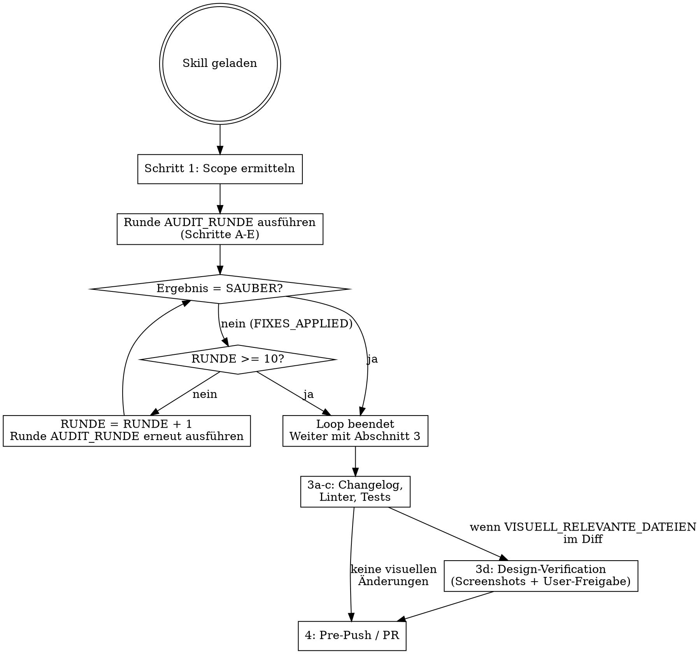

# Audit: Review aller offenen Änderungen

**SOFORT AUSFÜHREN — nicht erklären, nicht ankündigen. Direkt mit Schritt 1 beginnen.**

## Loop-Entscheidungsdiagramm



**ROTE FLAGGEN — sofort stoppen wenn du denkst:**
- "Ich warte auf Bestätigung vom User bevor ich die nächste Runde starte" → FALSCH. Loop läuft autonom.
- "Eine Runde reicht" → FALSCH. Erst wenn `SAUBER`, ist der Loop beendet.
- "Ich erkläre jetzt den Plan" → FALSCH. Direkt ausführen.
- "Design-Verification kann ich überspringen weil..." → FALSCH. Das Bash-Script entscheidet. Wenn `SCREENSHOTS_ERFORDERLICH`, MUSS der Screenshot-Agent dispatcht werden. Kein Ermessen, keine Interpretation. **Push ist BLOCKIERT bis der Screenshot-Agent `GO` zurückgibt.**
- "Ich pushe jetzt und mache Screenshots später" → FALSCH. Ohne `DESIGN_VERIFICATION_RESULT: GO` kein Push. Niemals.
- "In Runde 2 reichen nur Architecture und Code Quality" → FALSCH. In JEDER Runde werden ALLE zulässigen Subagents (1-7) dispatcht. IMMER. Fixes in einer Dimension können Issues in jeder anderen einführen.

## Ablauf

### 1. Scope ermitteln

```bash
DEFAULT_BRANCH=$(git symbolic-ref refs/remotes/origin/HEAD 2>/dev/null | sed 's@^refs/remotes/origin/@@' || echo "main")

# Deduplizierte Liste aller geänderten Dateien (committed + staged + unstaged seit origin)
sort -u <(git diff --name-only origin/$DEFAULT_BRANCH...HEAD 2>/dev/null) <(git diff --name-only) <(git diff --name-only --staged)

# Unified Diff für Subagents — ENTHÄLT ALLE COMMITS SEIT ORIGIN, nicht nur Session-Änderungen
# Hinweis: Die drei Diffs können sich überlappen. Das ist gewollt — committed-but-unpushed
# Änderungen tauchen in origin...HEAD auf, unstaged in `git diff`, staged in `git diff --staged`.
# Subagents tolerieren doppelte Hunks, und die Deduplizierung passiert in Schritt D.
git diff origin/$DEFAULT_BRANCH...HEAD 2>/dev/null; git diff; git diff --staged
```

**WICHTIG:** `git diff origin/$DEFAULT_BRANCH...HEAD` erfasst **alle** Commits die noch nicht in `origin/$DEFAULT_BRANCH` enthalten sind — also sowohl committed-but-unpushed als auch staged/unstaged Änderungen. Der Diff ist leer wenn alle Commits bereits gepusht wurden und keine lokalen Änderungen vorliegen. In diesem Fall: Melden und `/full-audit` empfehlen.

Keine Änderungen? Melden und beenden. Kein Git-Repo? Fehler melden. Kein Remote? `HEAD~5` als Fallback.

Erstelle:
- **ALLE_DATEIEN:** Vollständige Liste aller geänderten Dateien seit `origin/$DEFAULT_BRANCH` (inkl. aller uncommitted + committed-unpushed Commits)
- **FRONTEND_DATEIEN:** Nur Dateien mit Endung `.blade.php`, `.html`, `.vue`, `.tsx`, `.jsx`, `.ts`, `.js`, `.css`, `.scss`
- **TRANSLATION_DATEIEN:** Dateien in `lang/`, `locales/`, `translations/`, `messages/`, `i18n/` Verzeichnissen mit Endung `.php`, `.json`, `.yaml`, `.yml`, `.po`, `.pot`, `.ts`
- **VISUELL_RELEVANTE_DATEIEN:** Dateien die das visuelle Erscheinungsbild direkt oder indirekt beeinflussen:
  - **Direkt:** `.blade.php`, `.html`, `.vue`, `.tsx`, `.jsx`, `.css`, `.scss` (NICHT reine `.ts`/`.js` Logik-Dateien, ES SEI DENN sie enthalten JSX/Template-Code oder Style-Imports)
  - **Indirekt (Backend):** Dateien in visuell relevanten Backend-Verzeichnissen (aus PROJECT_CONTEXT, z.B. `app/Livewire/` bei Laravel), Controller die Views rendern (`return view(...)`, `return Inertia::render(...)`), Route-Dateien mit geänderten View-Zuweisungen. NICHT: reine Service-Klassen, Models, Migrations, Commands, Jobs, Middleware — es sei denn sie ändern was an den View übergeben wird (neue/entfernte/umbenannte Props/Variablen).
- **UNIFIED_DIFF:** Gesamter Diff aller Änderungen (für Subagents — kompakter als ganze Dateien)
- **SUPPRESSIONS:** Lade `$(git rev-parse --show-toplevel)/.claude/audits/suppressions.json` (falls vorhanden). Extrahiere die `pattern`-Felder als Liste. Falls Datei nicht existiert: `SUPPRESSIONS = "Keine Suppressions"`
- **PROJECT_CONTEXT:** Lade den `## Audit Context` Abschnitt aus der CLAUDE.md des Projekts:
  ```bash
  PROJECT_CLAUDE_MD="$(git rev-parse --show-toplevel)/CLAUDE.md"
  if [ -f "$PROJECT_CLAUDE_MD" ]; then
    PROJECT_CONTEXT=$(awk '/^## Audit Context$/{found=1; next} /^## /{found=0} found' "$PROJECT_CLAUDE_MD")
  fi
  ```
  Falls kein `## Audit Context` vorhanden: `PROJECT_CONTEXT = "Kein projektspezifischer Kontext."`
- **Framework-Erkennung:**
  ```bash
  if [ -f "artisan" ]; then
    FRAMEWORK="laravel"
    SOURCE_DIRS="app/ resources/ database/ routes/ config/"
  elif [ -f "package.json" ] && grep -q '"next"' package.json 2>/dev/null; then
    FRAMEWORK="nextjs"
    SOURCE_DIRS="src/ app/ pages/ components/ lib/"
  elif [ -f "nuxt.config.ts" ] || [ -f "nuxt.config.js" ]; then
    FRAMEWORK="nuxt"
    SOURCE_DIRS="components/ composables/ pages/ layouts/ server/"
  elif [ -f "manage.py" ]; then
    FRAMEWORK="django"
    SOURCE_DIRS="$(find . -name 'apps.py' -exec dirname {} \; | head -20 | tr '\n' ' ')"
  else
    FRAMEWORK="generic"
    SOURCE_DIRS="src/ lib/ app/"
  fi
  ```

Übergib `PROJECT_CONTEXT`, `FRAMEWORK` und `SOURCE_DIRS` an alle Subagents zusammen mit dem UNIFIED_DIFF.

---

## 2. Audit-Loop

Führe die folgende Prozedur `AUDIT_RUNDE` aus. Danach entscheide ob eine weitere Runde nötig ist. Maximal 10 Runden.

Initialisiere vor der ersten Runde:

```
RUNDE = 1
BEREITS_GEFIXT = []
```

---

### Prozedur AUDIT_RUNDE

Diese Prozedur wird als Ganzes ausgeführt. Am Ende steht IMMER eine Entscheidung: nächste Runde oder Loop beenden.

**Schritt A — Ankündigung und Todos**

Ausgabe: `Audit-Runde {RUNDE}/10`

TodoWrite: Erstelle zwei Todos für diese Runde:
- `Audit Runde {RUNDE} — Subagents dispatchen` (in_progress)
- `Audit Runde {RUNDE} — Findings fixen` (pending)

**Schritt B — Scope aktualisieren (ab Runde 2)**

Ab Runde 2: UNIFIED_DIFF neu berechnen (Abschnitt 1 wiederholen), da Fixes den Diff verändert haben. ALLE_DATEIEN und FRONTEND_DATEIEN bleiben identisch — die Dateilisten ändern sich nicht durch Fixes. Der komplette Diff (inklusive Fixes) wird allen Subagents erneut übergeben, damit sie den gesamten Code prüfen — nicht nur die Fixes.

**Schritt C — Subagents parallel dispatchen**

**PFLICHT: In JEDER Runde (auch Runde 2, 3, ...) werden ALLE zulässigen Subagents dispatcht.** Du darfst NICHT einzelne Subagents weglassen weil du denkst nur bestimmte Dimensionen seien von den letzten Fixes betroffen. Ein Security-Fix kann ein Performance-Problem einführen. Ein Architecture-Refactor kann A11y brechen. ALLE Subagents prüfen IMMER den GESAMTEN Diff.

Dispatche Subagents **in einem einzigen Message-Block** via Agent-Tool. Übergib den **UNIFIED_DIFF** (nicht die ganzen Dateien) plus die **Dateiliste** als Referenz. Subagents lesen einzelne Dateien nur wenn der Diff allein nicht ausreicht (z.B. für Kontext um eine Änderung herum).

Lies die Agent-Definitionen aus `agents/*.md` im Skill-Verzeichnis. Jede Datei enthält `subagent_type`, `model` und Fokus-Beschreibung.

| # | Agent-Datei | Kurzname |
|---|-------------|----------|
| 1 | `agents/1-architecture.md` | Architektur & Code Reuse |
| 2 | `agents/2-security.md` | Security |
| 3 | `agents/3-performance.md` | Performance & Efficiency |
| 4 | `agents/4-code-quality.md` | Code Quality & Simplification |
| 5 | `agents/5-seo.md` | SEO & Semantic HTML |
| 6 | `agents/6-a11y.md` | Accessibility (WCAG) |
| 7 | `agents/7-typography.md` | Typography |
| 8 | `agents/8-ui-design.md` | UI Visual Design |
| 9 | `agents/9-ux.md` | UX Patterns & Interaction |
| 10 | `agents/10-animation.md` | Animation & Motion Design |

Prompt-Template: Siehe `agents/prompt-template.md` — verwende den Abschnitt "Fuer /audit (Diff-basiert)".

**Überspringen-Regeln — JEDER Agent hat seine EIGENE Regel. Nicht gruppieren, nicht zusammenfassen.**

| Agent | Überspringen wenn | Bekommt |
|-------|-------------------|---------|
| 5 (SEO) | Keine FRONTEND_DATEIEN im Diff | Diff der FRONTEND_DATEIEN |
| 6 (A11y) | Keine FRONTEND_DATEIEN im Diff | Diff der FRONTEND_DATEIEN |
| 7 (Typography) | Weder FRONTEND_DATEIEN noch TRANSLATION_DATEIEN im Diff | Diff der FRONTEND_DATEIEN + TRANSLATION_DATEIEN |
| 8 (UI Design) | Keine FRONTEND_DATEIEN im Diff | Diff der FRONTEND_DATEIEN |
| 9 (UX) | Keine FRONTEND_DATEIEN im Diff | Diff der FRONTEND_DATEIEN |
| 10 (Animation) | Keine FRONTEND_DATEIEN im Diff | Diff der FRONTEND_DATEIEN |

**WICHTIG: Agents 5-10 laufen bei ALLEN Frontend-Dateien — auch bei app-internen Views, Admin-Panels, Dashboards. "Öffentlich vs. intern" ist IRRELEVANT.**

**Alles andere wird NICHT uebersprungen.** Subagents 1-4 laufen IMMER, in JEDER Runde, ueber den GESAMTEN Diff. Keine Ausnahmen.

**Schritt D — Zusammenfassung und Deduplizierung**

**Deduplizierung:** Wenn mehrere Subagents das gleiche Issue an der gleichen Stelle melden (z.B. Code-Reviewer und Security-Auditor finden beide eine fehlende Validierung), zu einem einzigen Finding zusammenfassen. Die strengere Einstufung gewinnt.

Konsolidiere alle Ergebnisse. Prüfe dabei SELBST (kein Subagent nötig), **nur in Runde 1:**
- **Documentation:** Erfordern die Änderungen ein Update der README.md oder CLAUDE.md?
- **Öffentliche Seiten:** Erfordern neue/geänderte/entfernte Features ein Update von Landing Pages, Changelog oder Hilfeseiten?
- **Tests:** Gibt es geänderte Logik ohne zugehörige Tests?
- **Mobile Apps:** Gibt es eine zugehörige iOS- oder Android-App die von den Änderungen betroffen sein könnte? (Siehe Mobile-App-Check unten)

**Mobile-App-Check (Runde 1):**

```bash
PROJECT_ROOT=$(git rev-parse --show-toplevel)
# iOS
IOS_DIR=$(find "$PROJECT_ROOT" -name "*.xcodeproj" -o -name "*.xcworkspace" -o -name "Podfile" -o -name "Package.swift" 2>/dev/null | head -1)
# Android
ANDROID_DIR=$(find "$PROJECT_ROOT" -name "build.gradle" -o -name "build.gradle.kts" -o -name "AndroidManifest.xml" 2>/dev/null | head -1)
# React Native
RN_CHECK=$(grep -l '"react-native"' "$PROJECT_ROOT/package.json" 2>/dev/null)
# Flutter
FLUTTER_CHECK=$(find "$PROJECT_ROOT" -name "pubspec.yaml" 2>/dev/null | head -1)
# Capacitor/Ionic
CAP_CHECK=$(find "$PROJECT_ROOT" -name "capacitor.config.*" 2>/dev/null | head -1)

[ -n "$IOS_DIR" ] && echo "MOBILE_APP=ios: $IOS_DIR"
[ -n "$ANDROID_DIR" ] && echo "MOBILE_APP=android: $ANDROID_DIR"
[ -n "$RN_CHECK" ] && echo "MOBILE_APP=react-native"
[ -n "$FLUTTER_CHECK" ] && echo "MOBILE_APP=flutter: $FLUTTER_CHECK"
[ -n "$CAP_CHECK" ] && echo "MOBILE_APP=capacitor: $CAP_CHECK"
```

Wenn eine Mobile-App erkannt wird, prüfe ob die Änderungen Auswirkungen haben:

| Änderung | Mobile-Relevanz |
|----------|-----------------|
| API-Endpunkte geändert/entfernt | Breaking Change — App muss aktualisiert werden |
| API-Response-Format geändert | Breaking Change — App-Parsing bricht |
| Neue API-Felder hinzugefügt | Kein Breaking Change — aber App nutzt sie nicht ohne Update |
| Auth-Flow geändert | Breaking Change — Login in App bricht |
| Push-Notification-Payload geändert | App empfängt falsche Daten |
| Deep-Link-Routen geändert | App-Navigation bricht |
| Shared Code geändert (Monorepo) | Direkt betroffen — prüfe ob App-Build noch funktioniert |
| Nur Frontend/Web geändert | Keine Mobile-Auswirkung (es sei denn WebView/Capacitor) |

Findings als **Important** einstufen wenn Breaking Changes erkannt werden, als **Minor** wenn nur neue Felder/Endpunkte hinzukommen.

Eigene Findings als Important einfügen.

**Ausgabe:**

```
## Audit Runde {RUNDE}/10 — X Dateien, Y Commits seit origin/{branch}

### Critical
- [Security] datei.ts:42 — Beschreibung

### Important
- [Code Quality] datei.ts:15 — Beschreibung

### Minor
- [SEO] page.tsx:8 — Beschreibung (optional, nicht Push-blockierend)

### Sauber
Performance, UI/UX/A11y
```

Markiere Todo `Audit Runde {RUNDE} — Subagents dispatchen` als completed.

**Schritt E — Auto-Fix (nur wenn Critical/Important vorhanden)**

Zähle die Critical- und Important-Findings dieser Runde.

**0 Critical und 0 Important?** → Markiere Todo `Audit Runde {RUNDE} — Findings fixen` als completed. → Prozedur endet mit Ergebnis: `SAUBER`.

**> 0 Critical oder Important?** → Markiere Todo als in_progress, dann:

1. Fixe **jedes Critical und Important Issue** direkt in den betroffenen Dateien.
2. Minor-Findings: fixen wenn einfach, sonst überspringen — sie blockieren den Push nicht.
3. Kurze Bestätigung pro Fix (`[Datei:Zeile] was gefixt wurde`).
4. NUR falls technisch nicht fixbar (z.B. architektonische Entscheidung nötig): als **Offener Punkt** mit Begründung auflisten.
5. Füge jedes gefixt Issue zur Liste BEREITS_GEFIXT hinzu (Datei:Zeile + Stichwort).

Markiere Todo als completed. → Prozedur endet mit Ergebnis: `FIXES_APPLIED`.

**PFLICHT: Gib am Ende jeder Runde exakt diese Zeile aus:**

```
AUDIT_STATUS: FIXES_APPLIED | RUNDE {RUNDE}/10
```

Für eine saubere Runde:

```
AUDIT_STATUS: SAUBER | RUNDE {RUNDE}/10
```

---

### Nach jeder Runde: Entscheidung

Nachdem Prozedur AUDIT_RUNDE abgeschlossen ist, triff SOFORT diese Entscheidung:

| Ergebnis | RUNDE | Aktion |
|----------|-------|--------|
| `SAUBER` | egal | **Loop beendet.** Weiter mit Abschnitt 3. |
| `FIXES_APPLIED` | < 10 | **Setze `RUNDE = RUNDE + 1` und führe Prozedur AUDIT_RUNDE erneut aus.** Fixes können neue Issues einführen — die nächste Runde verifiziert die Korrektheit. |
| `FIXES_APPLIED` | = 10 | **Loop beendet.** Verbleibende Issues auflisten, weiter mit Abschnitt 3. |

**DU BIST NICHT FERTIG wenn das Ergebnis `FIXES_APPLIED` ist und RUNDE < 10.** Kein User-Input nötig, kein Warten — sofort `RUNDE = RUNDE + 1` setzen und Prozedur AUDIT_RUNDE erneut starten. Das ist keine optionale Empfehlung — es ist eine zwingende Anforderung. Siehe Loop-Diagramm am Anfang des Skills.

### Loop-Ende

**Ausgabe nach Abschluss des Loops:**

```
Audit abgeschlossen nach {RUNDE} Runde(n).
- Runde 1: X Findings, Y gefixt
- Runde 2: X Findings, Y gefixt
...

Verbleibende offene Issues: (falls vorhanden)
- [Typ] Datei:Zeile — Beschreibung — Grund warum nicht fixbar
```

**Audit-Log schreiben:**

```bash
AUDIT_DIR="$(git rev-parse --show-toplevel 2>/dev/null)/.claude/audits"
mkdir -p "$AUDIT_DIR"
```

Schreibe `$AUDIT_DIR/$(date +%Y-%m-%d)-{branch-name}.md`:

```markdown
# Audit — {DATUM} — Branch: {BRANCH}

## Scope
- Commits seit origin/{base}: N
- Geänderte Dateien: Liste
- HEAD beim Audit: {git rev-parse HEAD}

## Ergebnis
- Runden: N/10
- Critical gefunden/gefixt: A/B
- Important gefunden/gefixt: C/D

## Gefixte Issues
- [Typ] datei:zeile — was gefixt wurde

## Design-Verification
- Screenshots: .claude/screenshots/{branch}-{hash}/ (oder "übersprungen — keine visuellen Dateien")
- Gescreenshottete URLs: Liste
- User-Entscheidung: Go / Manuell anpassen

## Offene Punkte
- (falls vorhanden)

## Sauber
Dimension1, Dimension2
```

Der `HEAD`-Commit wird im Log festgehalten. Beim nächsten Audit-Lauf wird geprüft:
```bash
git log --oneline {letzter-audit-HEAD}..HEAD
```
Falls dort Commits auftauchen, die **nicht** im Diff von `origin/$DEFAULT_BRANCH...HEAD` enthalten sind (z.B. weil sie inzwischen gepusht wurden), muss `/full-audit` ausgeführt werden — der normale `audit`-Skill sieht gepushte Commits nicht mehr.

Die `.claude/audits/`-Verzeichnis-Struktur erlaubt historisches Nachschlagen — wann welche Klasse zuletzt geprüft wurde.

## 3. Changelog, Linter, Tests und Design-Verification (einmal, nach dem Loop)

### 3a. Changelog/Release-Notes prüfen

Prüfe SELBST (kein Subagent nötig) ob user-facing Changes einen Changelog-Eintrag brauchen.

**Schritt 1 — Changelog-Datei finden:**

Suche nach typischen Changelog-Dateien: `CHANGELOG.md`, `changelog.md`, `release-notes/next.md`, `resources/changelog.md`, `CHANGES.md`. Keine gefunden → Abschnitt überspringen.

**Schritt 2 — User-facing Changes erkennen:**

Prüfe ob der Diff Dateien enthält, die auf user-facing Changes hindeuten:
- Routes (`routes/`), Views (`resources/views/`), Livewire-Components (`app/Livewire/`)
- Blade-Templates (`*.blade.php`), Translations (`lang/`)
- API-Endpunkte, Controller mit Response-Änderungen

**Ignorieren:** Reine Test-Änderungen, interne Services ohne UI-Auswirkung, Refactorings die das Verhalten nicht ändern, Config-Änderungen, Migrations ohne neue Features.

Keine user-facing Changes? Abschnitt überspringen.

**Schritt 3 — Changelog prüfen:**

Lies die Changelog-Datei. Prüfe ob bereits ein Eintrag existiert, der die aktuellen Änderungen beschreibt.

Eintrag vorhanden? Abschnitt überspringen.

**Schritt 4 — Eintrag draften:**

Schreibe einen kurzen Changelog-Eintrag basierend auf den Commits und dem Diff. Format orientiert sich am bestehenden Format in der Datei. Füge den Eintrag an der richtigen Stelle ein (chronologisch, neueste oben).

### 3b. Linter ausführen

Reihenfolge: Formatter → Linter → Static Analysis.

**PHP:**

| Erkennungsmerkmal | Befehl | Scope |
|---|---|---|
| `composer.json` mit `pint`-Dependency | `./vendor/bin/pint {GEÄNDERTE_PHP_DATEIEN}` | Geänderte Dateien |
| `.php-cs-fixer.php` | `./vendor/bin/php-cs-fixer fix {GEÄNDERTE_PHP_DATEIEN}` | Geänderte Dateien |
| `composer.json` mit `phpcs`-Script | `composer phpcs:fix` | Geänderte Dateien |
| `phpstan.neon` | `./vendor/bin/phpstan analyse` | **Immer global** (Typsystem kennt keine Dateigrenze) |

**JavaScript/CSS:**

| Erkennungsmerkmal | Befehl | Scope |
|---|---|---|
| `eslint.config.*` oder `.eslintrc*` | `npx eslint --fix {GEÄNDERTE_JS_DATEIEN}` | Geänderte Dateien |
| `.prettierrc*` oder `prettier.config.*` | `npx prettier --write {GEÄNDERTE_JS_CSS_DATEIEN}` | Geänderte Dateien |
| `.stylelintrc*` | `npx stylelint --fix {GEÄNDERTE_CSS_DATEIEN}` | Geänderte Dateien |

Bei Static-Analysis-Fehlern: manuell fixen, erneut laufen lassen. Wiederholen bis sauber.

**PHPCS: pre-existierende Fehler**

IMMER alle PHPCS-Fehler beheben — auch in Dateien die wir nicht direkt geändert haben. CI prüft das gesamte Repo. Nur Warnings (nicht Errors) können mit `--runtime-set ignore_warnings_on_exit 1` ignoriert werden.

### 3c. Test-Suite ausführen

Test-Runner automatisch erkennen:

| Erkennungsmerkmal | Befehl |
|---|---|
| `composer.json` mit `test`-Script | `composer test` |
| `package.json` mit `test`-Script | `npm test` |
| `phpunit.xml` (ohne Composer-Script) | `php artisan test` oder `./vendor/bin/phpunit` |
| `vitest.config.*` | `npx vitest run` |
| `jest.config.*` | `npx jest` |
| `pytest.ini` oder `pyproject.toml` mit pytest | `pytest` |

Alle erkannten Runner ausführen. Bei Failures: fixen, erneut laufen lassen. Wiederholen bis grün oder klar nicht automatisch fixbar. Unfixbare Failures als **Critical** aufnehmen.

**CHECKPOINT — DETERMINISTISCHER DESIGN-CHECK (kein LLM-Ermessen)**

Führe dieses Bash-Script aus. Das Ergebnis bestimmt ob Design-Verification stattfindet — nicht deine Einschätzung.

```bash
PROJECT_ROOT=$(git rev-parse --show-toplevel)
DEFAULT_BRANCH=$(git symbolic-ref refs/remotes/origin/HEAD --short 2>/dev/null | sed 's|origin/||' || echo main)
EXTENSIONS='*.blade.php *.html *.vue *.tsx *.jsx *.css *.scss'

# Framework-spezifisches Verzeichnis für visuell relevante Backend-Dateien
if [ -f "$PROJECT_ROOT/artisan" ]; then
  VISUAL_BACKEND_PATTERN='app/Livewire/**/*.php'
elif [ -f "$PROJECT_ROOT/package.json" ] && grep -q '"next"' "$PROJECT_ROOT/package.json" 2>/dev/null; then
  VISUAL_BACKEND_PATTERN='src/**/*.tsx src/**/*.jsx app/**/*.tsx app/**/*.jsx'
elif [ -f "$PROJECT_ROOT/nuxt.config.ts" ] || [ -f "$PROJECT_ROOT/nuxt.config.js" ]; then
  VISUAL_BACKEND_PATTERN='components/**/*.vue pages/**/*.vue layouts/**/*.vue'
else
  VISUAL_BACKEND_PATTERN=''
fi

# Alle nicht gepushten Commits UND alle offenen Änderungen (staged + unstaged + untracked)
COMMITTED=$(git diff --name-only origin/$DEFAULT_BRANCH...HEAD -- $EXTENSIONS $VISUAL_BACKEND_PATTERN 2>/dev/null)
STAGED=$(git diff --cached --name-only -- $EXTENSIONS $VISUAL_BACKEND_PATTERN 2>/dev/null)
UNSTAGED=$(git diff --name-only -- $EXTENSIONS $VISUAL_BACKEND_PATTERN 2>/dev/null)
UNTRACKED=$(git ls-files --others --exclude-standard -- $EXTENSIONS $VISUAL_BACKEND_PATTERN 2>/dev/null)

ALL_VISUAL=$(printf '%s\n' "$COMMITTED" "$STAGED" "$UNSTAGED" "$UNTRACKED" | grep -v '^$' | sort -u)

if [ -n "$ALL_VISUAL" ]; then
  echo "DESIGN_CHECK_RESULT=SCREENSHOTS_ERFORDERLICH"
  echo "DATEIEN:"
  echo "$ALL_VISUAL"
else
  echo "DESIGN_CHECK_RESULT=KEINE_VISUELLEN_DATEIEN"
fi
```

**Auswertung:**

```
if output contains "KEINE_VISUELLEN_DATEIEN" → weiter mit Empfehlungen/Abschnitt 4
if output contains "SCREENSHOTS_ERFORDERLICH" → User fragen (siehe unten)
```

Wenn `SCREENSHOTS_ERFORDERLICH`, frage den User via AskUserQuestion:

```
Design-Verification: {N} visuelle Dateien geändert.

{Liste der Dateien}

Screenshots machen?
```

Optionen:
- **Ja, Screenshots** — Screenshot-Agent wird gestartet
- **Nein, überspringen** — Keine Screenshots, direkt weiter

| Antwort | Aktion |
|---------|--------|
| **Ja, Screenshots** | Weiter mit Schritt 3d (Screenshot-Agent) |
| **Nein, überspringen** | `DESIGN_VERIFICATION_RESULT: SKIPPED_BY_USER`. Weiter mit Empfehlungen/Abschnitt 4. |

### 3d. Design-Verification — Screenshot-Agent dispatchen

**Nur wenn User "Ja, Screenshots" gewählt hat.**

**DIESER SCHRITT IST EIN EINZIGER TOOL-CALL.** Du übergibst alles an den Screenshot-Agent und wartest auf sein Ergebnis. Du machst NICHTS selbst — kein Server starten, keine URLs ermitteln, kein Screenshot-Verzeichnis anlegen. Das macht alles der Screenshot-Agent.

**WICHTIG: Der Screenshot-Agent läuft im Foreground** (NICHT `run_in_background`), weil er:
1. Den User um Screenshot-Freigabe fragen muss (AskUserQuestion)
2. Möglicherweise Computer Use nutzt (braucht interaktive Session)

```
Agent(
  subagent_type: general-purpose,
  model: sonnet,
  prompt: "Lies agents/screenshot-agent.md im Skill-Verzeichnis und führe den kompletten Ablauf aus.
    PROJECT_ROOT={PROJECT_ROOT}
    VISUELL_RELEVANTE_DATEIEN={DATEIEN_AUS_BASH_CHECK}
    FRAMEWORK={FRAMEWORK}"
)
```

Warte auf das Ergebnis. Werte `DESIGN_VERIFICATION_RESULT` aus:

| Ergebnis | Aktion |
|----------|--------|
| `GO` | TodoWrite completed. Weiter mit Empfehlungen/Abschnitt 4. |
| `SKIPPED_NO_TOOL` | Im Audit-Log vermerken. Weiter mit Empfehlungen/Abschnitt 4. |

**Empfehlungen umsetzen (Offene Punkte):**

Wenn `## Offene Punkte` im Audit-Log Einträge enthält — frage den User via AskUserQuestion:

```
Audit-Empfehlungen: {N} offene Punkte gefunden.

{Liste der Offenen Punkte}

Soll ich diese direkt umsetzen?
```

Optionen:
- **Ja, alle** — Alle Offenen Punkte jetzt umsetzen
- **Einzeln entscheiden** — Jeden Punkt einzeln bestätigen
- **Nein, später** — Punkte bleiben im Audit-Log für später

| Antwort | Aktion |
|---------|--------|
| **Ja, alle** | Jeden Offenen Punkt implementieren, dann weiter mit Abschnitt 4 |
| **Einzeln entscheiden** | Pro Punkt AskUserQuestion → bestätigt: implementieren, abgelehnt: überspringen |
| **Nein, später** | Nichts ändern, weiter mit Abschnitt 4 |

Keine Offenen Punkte? Diesen Schritt überspringen, direkt weiter mit Abschnitt 4.

---

## 4. Pre-Push-Verhalten

Wenn der Audit im Kontext eines blockierten `git push` läuft — dann:

**Noch unfixbare Critical/Important-Findings, Linter-Fehler oder Tests rot:**
- `BLOCKED: Push abgebrochen.` + Auflistung aller offenen Probleme.
- KEINE Marker-Datei schreiben.

**SPERRE: Wenn `DESIGN_CHECK_RESULT=SCREENSHOTS_ERFORDERLICH` war und User "Ja, Screenshots" gewählt hat, aber `DESIGN_VERIFICATION_RESULT` NICHT `GO` ist → NICHT pushen.** Bei `SKIPPED_BY_USER` oder `SKIPPED_NO_TOOL` darf gepusht werden — der User hat bewusst entschieden.

**Alles gefixt, Tests grün UND Design-Verification bestanden (oder keine visuellen Dateien) — Marker schreiben und pushen:**

**KRITISCH — Marker und Push niemals im selben Bash-Befehl:** Der Pre-Push-Hook prüft den Command-String auf `git push` — wenn `git push` im String vorkommt, blockiert der Hook BEVOR der Marker geschrieben wird. Immer zwei separate Bash-Aufrufe.

**Schritt 1 — Marker schreiben (separater Bash-Aufruf, kein `git push` im Befehl):**

```bash
# Hash aus dem aktuellen Session-CWD berechnen (ohne vorheriges cd):
hash=$(echo -n "$PWD" | md5 2>/dev/null || echo -n "$PWD" | md5sum 2>/dev/null | cut -d' ' -f1)
touch "/tmp/claude-audit-passed-$hash"
echo "Marker: /tmp/claude-audit-passed-$hash"
```

**Schritt 2 — Pushen (separater Bash-Aufruf):**

```bash
git push
# Oder für Multi-Repo ohne cd:
git -C /pfad/zum/repo push
```

**Schritt 3:** `Audit passed.` + Zusammenfassung inkl. Fixes anzeigen. Weiter mit Abschnitt 5 (Learning) und dann Abschnitt 6 (PR erstellen).

**Marker-Details:**
- Gilt nur für den unmittelbar folgenden Push — wird nach Verwendung sofort gelöscht
- Jeder Push benötigt einen frischen Marker (Schritt 1 wiederholen)
- Der Hook prüft nur Existenz + Alter (< 5 Min) — der Datei-Inhalt ist irrelevant, `touch` reicht

**Multi-Repo-Pushes (mehrere Repos in einer Session):**

Der Hook berechnet den Hash aus `.cwd` im Tool-JSON — das ist das **Session-Startverzeichnis** (unveränderlich, unabhängig von `cd` im Command). Das Session-CWD ist `$PWD` in einem Bash-Tool-Aufruf **ohne** vorherigem `cd`.

Deshalb für Multi-Repo-Pushes:
- **`git -C /pfad/zum/repo push`** statt `cd /pfad && git push` — damit bleibt `.cwd` konstant
- Vor jedem Push Schritt 1 wiederholen (Marker neu erstellen)
- Nie `cd` im selben Bash-Aufruf wie `git push` verwenden

---

## 5. Learning (nach Audit-Log)

Nach dem Audit-Log dispatche den Learning-Agent als Subagent:

```
Agent(
  prompt: Lies agents/learning-agent.md im Skill-Verzeichnis und führe den Ablauf aus.
    PROJECT_ROOT={PROJECT_ROOT}
    AKTUELLES_LOG={Inhalt des gerade geschriebenen Audit-Logs}
    AUDIT_TYPE=audit
  subagent_type: general-purpose
  mode: bypassPermissions
  run_in_background: true
)
```

**Der Learning-Agent läuft im Hintergrund** — er blockiert weder Push noch PR.

Wenn der Learning-Agent Guideline-Vorschläge zurückgibt (`GUIDELINE_SUGGESTIONS > 0`), zeige sie dem User per AskUserQuestion:

```
Der Audit hat {N} wiederkehrende Patterns erkannt. Vorgeschlagene Guideline-Änderungen:

1. {guideline-datei}: {Beschreibung}
2. ...
```

Optionen:
- **Alle übernehmen** — Alle Vorschläge in Guidelines einarbeiten
- **Einzeln prüfen** — Jeden Vorschlag einzeln bestaetigen
- **Später** — Vorschläge stehen im Learning-Log

| Antwort | Aktion |
|---------|--------|
| **Alle übernehmen** | Guidelines anpassen, weiter |
| **Einzeln prüfen** | Pro Vorschlag AskUserQuestion, dann anpassen |
| **Später** | Nichts ändern, weiter |

---

## 6. PR erstellen (nach Push)

Wenn der Push erfolgreich war und wir auf einem Feature-/Fix-Branch sind — automatisch einen PR erstellen.

**Schritt 1 — Prüfen ob PR sinnvoll:**

```bash
CURRENT_BRANCH=$(git branch --show-current)
DEFAULT_BRANCH=$(git symbolic-ref refs/remotes/origin/HEAD 2>/dev/null | sed 's@^refs/remotes/origin/@@' || echo "main")
```

Abbrechen wenn:
- `CURRENT_BRANCH` ist `main`, `master` oder `$DEFAULT_BRANCH`
- `gh pr view` zeigt bereits einen offenen PR für diesen Branch
- `gh auth status` schlägt fehl (nicht eingeloggt)

**Schritt 2 — Daten sammeln:**

```bash
# Commits seit Base-Branch
git log origin/$DEFAULT_BRANCH..HEAD --oneline

# Geänderte Dateien
git diff origin/$DEFAULT_BRANCH...HEAD --stat

# Plan-Doc suchen (falls vorhanden)
ls docs/plans/*.md 2>/dev/null
```

Falls ein Plan-Doc existiert das zum aktuellen Feature passt (Datum oder Thema im Dateinamen), den Inhalt als Kontext für die PR-Description nutzen.

**Schritt 3 — PR erstellen:**

Titel: Conventional Commit Stil, abgeleitet aus den Commits. Beispiele:
- `feat: add time entry bulk export`
- `fix: correct invoice calculation for partial hours`
- `refactor: extract billing service from controller`

Body via HEREDOC:

```bash
gh pr create --title "$TITLE" --body "$(cat <<'EOF'
## Summary
- Bullet 1: Was wurde gemacht
- Bullet 2: Warum
- Bullet 3: Wichtige Details (optional)

## Changes
- **Added:** Neue Features/Dateien
- **Changed:** Geänderte Funktionalität
- **Fixed:** Behobene Bugs

## Test Plan
- [ ] Relevante Testschritte
- [ ] Edge Cases

## Breaking Changes
Beschreibung falls vorhanden

Generated with [Claude Code](https://claude.ai/code)

Co-Authored-By: Claude Opus 4.6 <noreply@anthropic.com>
EOF
)"
```

Leere Sections weglassen — nicht mit "Keine" füllen. Keine Breaking Changes? Section weglassen.

**Schritt 4 — PR-URL ausgeben.**

PR erstellt? URL anzeigen. Fehler? Melden und weitermachen — ein fehlgeschlagener PR blockiert nicht den Push.
